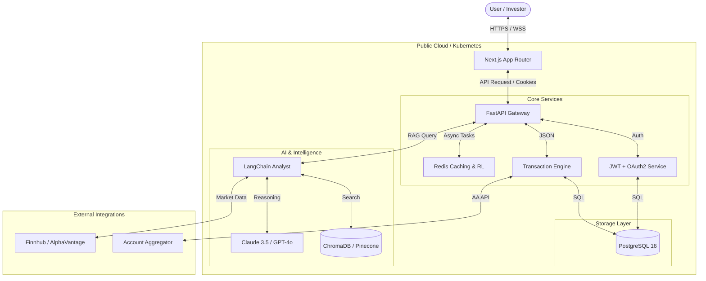

# 🏦 WealthWise AI: Production System Design & Architecture

This document outlines the architecture, data flow, and implementation plan for the **WealthWise AI** platform, designed as a production-grade, investor-ready fintech solution.

## 🏗️ 1. System Architecture (High-Level)



## 📂 2. Folder Structure (Monorepo/Polyrepo Ready)

```text
/wealthwise-ai
├── /backend            # Python FastAPI Service
│   ├── /app
│   │   ├── /api        # API Routes (v1, v2)
│   │   ├── /core       # Config, Security, Auth
│   │   ├── /models     # SQLModel / SQLAlchemy Entities
│   │   ├── /schemas    # Pydantic Validation
│   │   ├── /services   # Business Logic (Fintech, Auth)
│   │   └── /ai         # LangChain, RAG, Rerankers
│   ├── /tests          # Pytest suite
│   ├── main.py         # Entry point
│   └── requirements.txt
├── /frontend           # Next.js 14+ (App Router)
│   ├── /app            # Pages (Dashboard, Expenses, Chat)
│   ├── /components     # ShadCN UI components
│   ├── /hooks          # Custom React hooks (useAuth, useSync)
│   ├── /lib            # Utils (formatting, crypt)
│   └── /styles         # Tailwind Global CSS
├── /database           # SQL Migration & Seeds
└── /infra              # Docker, K8s, Terraform
```

## 🏦 3. Database Schema Highlights
- **PostgreSQL 16**: Primary source of truth.
- **AES-256 Encryption**: Sensitive fields (`amount`, `balance`, `pii`) are encrypted at rest using application-level keys.
- **RLS (Row Level Security)**: Strict tenant isolation at the database level.
- **Audit Logging**: Immutable, digitally signed logs for every financial action.

## 🤖 4. AI & RAG Strategy
- **Embedding**: Transactions are vectorized using `text-embedding-3-small`.
- **Retrieval**: Hybrid Search (BM25 + Vector) to handle specific time-ranges and semantic queries.
- **Prompting**: System persona "Senior Wealth Advisor" with access to real-time math tools (no hallucinated calculations).

## 🔐 5. Security & Best Practices
- **Authentication**: JWT stored in `HttpOnly`, `Secure`, `SameSite=Strict` cookies.
- **Rate Limiting**: Redis-backed leaky bucket algorithm per IP/User.
- **Audit Trail**: Every `GET /transactions` or `POST /ai/query` is logged with an integrity hash.
- **Performance**: CDN for static assets; Redis for query results.

---
*Built for scale, audited for security.*
